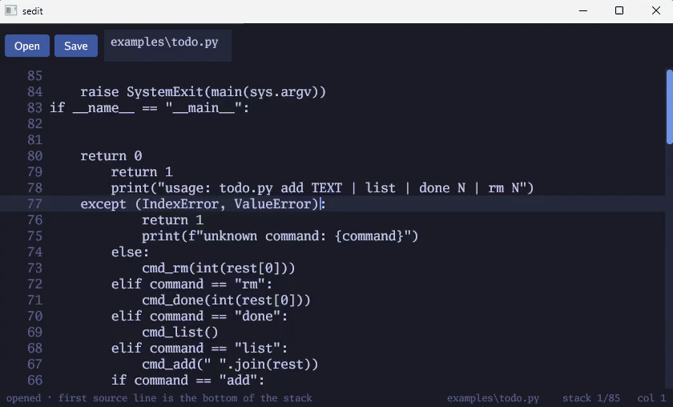

# sedit

A bottom-up source editor. The first line of the file sits at the bottom of the window, and later lines stack upward, so the text grows the way a call stack does. Files on disk stay in normal source order.



The clip is `examples/todo.py` opened in sedit. The view scrolls from the top of the stack down toward the base of the file.

```
go run . examples/todo.py
```

Open picks a file. Enter in the path bar opens that path. Ctrl+S saves. The scrollbar and the wheel move through the whole file.

## Example

`examples/todo.py` is a small command-line todo list:

```
python examples/todo.py add "write the bottom of the stack first"
python examples/todo.py list
python examples/todo.py done 1
```

## License

[CC0 1.0 Universal](https://creativecommons.org/publicdomain/zero/1.0/). The work is dedicated to the public domain. See [LICENSE](LICENSE).
